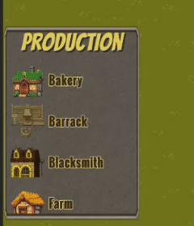

# Infinite Scrollview 📜

## Overview

Infinite is a Unity-based production menu system that generates infinite scroll view menus. It follows the Model-View-Controller (MVC) pattern to maintain a clean and scalable codebase.



## Table of Contents

1. [Features](#features)
2. [Installation](#installation)
3. [Usage](#usage)
4. [Code Structure](#code-structure)
5. [References](#references)

## Features ⭐

- Infinite scrolling of production items.
- Dynamic pooling and adding of items to the scroll view.
- Clear separation of concerns following the MVC pattern.

## Installation 📦

1. Clone the repository.
2. Open the project in Unity.
3. Ensure the necessary dependencies (e.g., TextMeshPro) are installed.
4. Add the provided scripts to your Unity project.

## Usage 📝

1. Attach the `ProductionMenuModel` script to a GameObject in your scene.
2. Attach the `ProductionMenuView` script to a GameObject in your scene with a `ScrollRect` component.
3. Attach the `ProductionMenuController` script to a GameObject in your scene.
4. Set up the required references in the inspector for the `ProductionMenuModel`, `ProductionMenuView`, and `ProductionMenuController` scripts. You can use prefabs given in the repository.
5. Run the scene to see the infinite scroll view menu in action.

## Code Structure 🚀

### `ProductionMenuModel.cs`

```csharp
[SerializeField] private GameObject[] items;
public List<GameObject> ItemPool { get; private set; } = new List<GameObject>();

public void PoolItems()
{
    ItemPool.Clear();
    for (int a = 0; a < 5; a++)
    {
        for (int i = 0; i < items.Length; i++)
        {
            ItemPool.Add(items[i]);
        }
    }
}
```

The `ProductionMenuModel` class is responsible for managing the data of the infinite menu. It handles pooling of items to be displayed in the scroll view.

##

### `ProductionMenuView.cs`

```csharp
    [SerializeField] private ScrollRect scrollView;

    void Update()
    {
        if (scrollView.verticalNormalizedPosition <= 0.05f)
        {
            OnScrollNearBottom?.Invoke();
        }
    }

    public void AddItemToView(GameObject itemPrefab, Sprite itemImage, string itemName)
    {
        var product = Instantiate(itemPrefab, Vector3.zero, Quaternion.identity, scrollView.content);
        product.GetComponentInChildren<Image>().sprite = itemImage;
        product.GetComponentInChildren<TMPro.TextMeshProUGUI>().text = itemName;
    }
```

The `ProductionMenuView` class is responsible for managing the UI components of the infinite menu. It checks the scroll position and notifies the controller when new items need to be added.

##

### `ProductionMenuController.cs`

```csharp
public static ProductionMenuController Instance { get; private set; }
[SerializeField] private ProductionMenuModel productionMenuModel;
[SerializeField] private ProductionMenuView productionMenuView;
[SerializeField] private GameObject itemPrefab;
. . .
public void AddItems()
{
    productionMenuModel.PoolItems();
    foreach (var item in productionMenuModel.ItemPool)
    {
        var itemModel = item.GetComponent<ProductionItemModel>();
        productionMenuView.AddItemToView(itemPrefab, itemModelItemImage, itemModel.ItemName);
    }
}
```

The `ProductionMenuController` class is responsible for managing the interaction logic of the infinite menu. It handles adding items to the UI when the scroll view is near the bottom.

##

### `ProductionItemModel.cs`

```csharp
public string ItemName;
public Sprite ItemImage;
public GameObject ItemPrefab;
```

The `ProductionItemModel` class represents an individual production item with a name, image, and prefab.

## References 📚

- Unity Documentation: [Unity ScrollRect](https://docs.unity3d.com/Manual/script-ScrollRect.html)
- TextMeshPro Documentation: [TextMeshPro](https://docs.unity3d.com/Packages/com.unity.textmeshpro@2.1/manual/index.html)
- MVC Pattern: [Model-View-Controller (MVC)](https://en.wikipedia.org/wiki/Model%E2%80%93view%E2%80%93controller)
