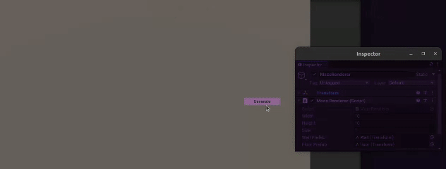

# Maze Generation in Unity using Recursive Backtrack

## Overview

This document provides a detailed explanation of the maze generation algorithm using the recursive backtrack method implemented in Unity. The recursive backtrack algorithm is a depth-first search algorithm that creates a perfect maze with no loops and a single solution path from the start to the end.

   

## Table of Contents

1. [Introduction](#introduction)
2. [Code Explanation](#code-explanation)
   - [Grid Initialization](#grid-initialization)
   - [Generate](#generate)
   - [ApplyRecursiveBacktracker](#applyrecursivebacktracker)
   - [GetUnvisitedNeighbours](#getunvisitedneighbours)
   - [GetOppositeWall](#getoppositewall)
3. [References](#references)

## Introduction

In this project, we generate a maze in Unity using the recursive backtrack algorithm. This algorithm is known for its simplicity and efficiency in creating a perfect maze. The key steps involve initializing a grid, recursively visiting cells, and removing walls to form the maze.

## Code Explanation

### Grid Initialization

The maze is represented as a 2D array of `WallState` enumerations, which define the walls for each cell.

```csharp
[Flags]
public enum WallState
{
    // Wall state flags
    Left = 1,    // 0001
    Right = 2,   // 0010
    Up = 4,      // 0100
    Down = 8,    // 1000
    Visited = 128 // 1000 0000
}

public struct Position
{
    public int X;
    public int Y;
}
```

The `WallState` enum uses bit flags to represent the walls on each side of a cell. The `Position` struct holds the coordinates of a cell.

### Generate

The **Generate** method initializes the grid with all walls intact and then applies the recursive backtracking algorithm.

```csharp
public static WallState[,] Generate(int width, int height)
{
    // Initialize the maze with walls
        WallState[,] maze = new WallState[width, height];
        WallState initialWalls = WallState.Left | WallState.Right | WallState.Up | WallState.Down;

        for (int i = 0; i < width; ++i)
        {
            for (int j = 0; j < height; ++j)
            {
                maze[i, j] = initialWalls; // Set all walls for each cell
            }
        }

        // Create a random exit on the right wall of the last column
        var random = new Random();
        int exitY = random.Next(0, height);
        maze[width - 1, exitY] &= ~WallState.Right;

        // Apply the recursive backtracker algorithm to generate the maze
        return ApplyRecursiveBacktracker(maze, width, height);
}
```

This method creates a 2D array of `WallState` and initializes each cell with all four walls intact. It also creates a random exit on the right wall of the maze. Finally, it calls the `ApplyRecursiveBacktracker` method to generate the maze.

### ApplyRecursiveBacktracker

The `ApplyRecursiveBacktracker` method is where the recursive backtracking algorithm is implemented.

```csharp
private static WallState[,] ApplyRecursiveBacktracker(WallState[,] maze, int width, int height)
{
    . . .

    // Mark the starting position as visited and push it onto the stack
    maze[startPosition.X, startPosition.Y] |= WallState.Visited;
    stack.Push(startPosition);

    while (stack.Count > 0)
        {
            var current = stack.Pop();
            var neighbours = GetUnvisitedNeighbours(current, maze, width, height);

            if (neighbours.Count > 0)
            {
                // Push current position back onto the stack
                stack.Push(current);

                // Choose a random neighbour to move to
                var randIndex = rng.Next(0, neighbours.Count);
                var randomNeighbour = neighbours[randIndex];

                var neighbourPosition = randomNeighbour.NeighbourPos;

                // Remove walls between current cell and chosen neighbour
                maze[current.X, current.Y] &= ~randomNeighbour.SharedWall;
                maze[neighbourPosition.X, neighbourPosition.Y] &= ~GetOppositeWall(randomNeighbour.SharedWall);

                // Mark the neighbour as visited and push it onto the stack
                maze[neighbourPosition.X, neighbourPosition.Y] |= WallState.Visited;
                stack.Push(neighbourPosition);
            }
        }
    . . .
}

```

This method uses a stack to keep track of the positions as it generates the maze. It starts with a random position, marks it as visited, and then iteratively processes each position by checking its unvisited neighbours. For each unvisited neighbour, it removes the wall between the current cell and the neighbour, marks the neighbour as visited, and pushes the neighbour's position onto the stack.

### GetUnvisitedNeighbours

This method finds all unvisited neighbours of a given cell.

```csharp
public static List<Neighbour> GetUnvisitedNeighbours(Position pos, WallState[,] maze, int width, int height)
{
    var neighbours = new List<Neighbour>();

        // Check left neighbour
        if (pos.X > 0 && !maze[pos.X - 1, pos.Y].HasFlag(WallState.Visited))
        {
            neighbours.Add(new Neighbour
            {
                NeighbourPos = new Position { X = pos.X - 1, Y = pos.Y },
                SharedWall = WallState.Left
            });
        }

        // Check down neighbour
        if (pos.Y > 0 && !maze[pos.X, pos.Y - 1].HasFlag(WallState.Visited))
        {
            . . .
        }

        // Check up neighbour
        if (pos.Y < height - 1 && !maze[pos.X, pos.Y + 1].HasFlag(WallState.Visited))
        {
            . . .
        }

        // Check right neighbour
        if (pos.X < width - 1 && !maze[pos.X + 1, pos.Y].HasFlag(WallState.Visited))
        {
            . . .
        }

        return neighbours;
}
```

This method checks each of the four possible neighbouring cells (left, down, up, right) to see if they are within bounds and unvisited. If they are, it adds them to the list of unvisited neighbours, including the wall that is shared with the current cell.

### GetOppositeWall

This method returns the opposite wall for a given wall.

```csharp
private static WallState GetOppositeWall(WallState wall)
{
    return wall switch
        {
            WallState.Right => WallState.Left,
            WallState.Left => WallState.Right,
            WallState.Up => WallState.Down,
            WallState.Down => WallState.Up,
            _ => WallState.Left // Default case
        };
}
```

This method is a helper function that returns the opposite wall given a WallState. For example, if the input is `WallState.Right`, it returns `WallState.Left`.

## References

- [Recursive Backtracking Algorithm](https://en.wikipedia.org/wiki/Maze_generation_algorithm#Recursive_backtracker)
- [Unity Documentation](https://docs.unity3d.com/Manual/index.html)
