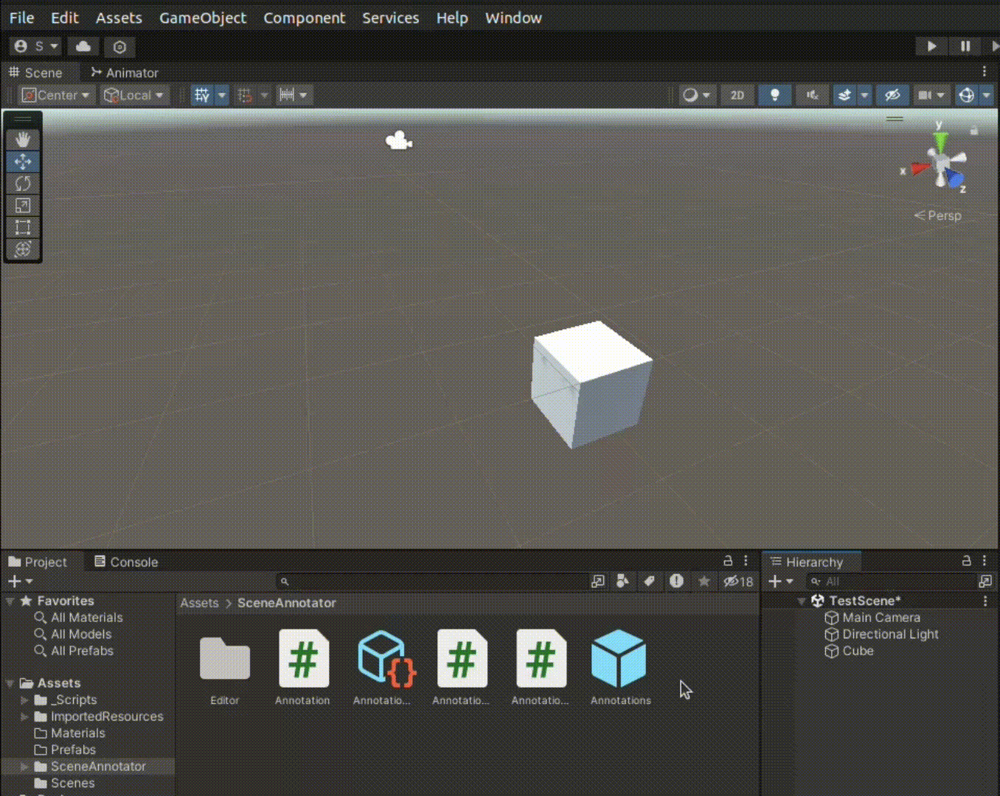

# Scene Annotation Tool 📝



## Overview

The Scene Annotation Tool is a Unity Editor extension designed to enhance collaboration and organization within Unity scenes. On the non-technical side, it allows developers to leave detailed notes and markers directly in the Scene view, facilitating better teamwork and scene documentation. From a technical perspective, the tool leverages custom Editor Windows using Unity's `EditorWindow`, employs `ScriptableObject` for persistent and serialized annotation storage, and utilizes Unity's `Handles` for custom drawing and interactive elements. It also offers customizable annotation styles, including text color, background, and handle interactions, making it versatile tool.

## Table of Contents

1. [Overview](#overview)
2. [Installation](#installation)
3. [Using the Tool 🛠️](#using-the-tool-)
4. [Code Explanation 🧩](#code-explanation-)
5. [References 📚](#references)

## Installation

1. Download the zip file.
2. Unzip the downloaded file.

### Option 1: Using the .unitypackage 📦

3. In Unity, go to `Assets` > `Import Package` > `Custom Package...`.
4. Navigate to the unzipped folder and select `SceneAnnotator.unitypackage`.
5. Click `Import` in the Import Unity Package window.

### Option 2: Directly Transferring Files 📁

3. Copy the `SceneAnnotationTool` folder from the unzipped content.
4. Paste the `SceneAnnotationTool` folder into the `Assets` directory of your Unity project.

## Using the Tool 🛠️

1. You can use `AnnotationData.asset` given in package, or create your own. In `Assets`, right click, `Create` > `SceneAnnotations` > `AnnotationData`.
2. Drag the `Annotations.prefab` to your scene hierarchy, or create a gameobject and add component `AnnotationManager`.
3. Drag & drop `AnnotationData.asset` to section in `AnnotationManager`.
4. Open the `SceneAnnotationTool` window from the Unity menu: `Window` > `Scene Annotations`.
5. Use the tool to add and remove annotations in the Scene view.

## Code Explanation 🧩

### Annotation.cs

This script defines the `Annotation` class, which stores the position, message, and color of an annotation.

```csharp
[System.Serializable]
public Annotation(Vector3 position, string message, Color color, string details)
    {
        this.Position = position;
        this.Message = message;
        this.Color = color;
        this.Details = details;
    }
```

### AnnotationData.cs

This script defines the `AnnotationData` class, which is a ScriptableObject used to store a list of annotations.

```csharp
[CreateAssetMenu(fileName = "AnnotationData", menuName = "SceneAnnotations/AnnotationData")]
public class AnnotationData : ScriptableObject
{
    public List<Annotation> Annotations = new List<Annotation>();
}
```

### AnnotationManager.cs

This script holds a list of Annotation objects and provides serialization functionality for saving and loading data.

```csharp
public class AnnotationManager : MonoBehaviour
{
    public AnnotationData annotationData;
}
```

### AnnotationManagerEditor.cs

This script provides a custom editor for the `AnnotationManager`, enabling annotations to be displayed in the Scene view with background styling.

```csharp
private void OnSceneGUI()
{
    AnnotationManager manager = (AnnotationManager)target;
    if (manager.annotationData != null)
    {
        foreach (var annotation in manager.annotationDataAnnotations)
        {
            . . .
            // Draw a sphere handle at the calculated position
            if (Handles.Button(handlePosition, Quaternion.identity,0.5f, 0.5f, Handles.SphereHandleCap))
            {
                // Button action, customize as needed
                Debug.Log("Title: " + annotation.Message + " Details:" + annotation.Details);
            }
            // Draw a line connecting the annotation to the handle
            Handles.DrawLine(annotation.Position, handlePosition,2f);
            // Reset handle color
            Handles.color = oldColor;
            // Draw the background rectangle behind the text
            DrawTextBackground(annotation);
            // Draw the text with customized style
            Handles.Label(annotation.Position, annotation.Message,labelStyle());
        }
    }
}

private GUIStyle labelStyle()
{
    GUIStyle style = new GUIStyle();
    . . .
    return style;
}

private void DrawTextBackground(Annotation annotation)
{
    . . .
    Vector3 screenPos = HandleUtility.WorldToGUIPoint(annotationPosition);
    Rect rect = . . .

    // Draw the background rectangle
    Handles.BeginGUI();
    . . .
}
```

### AnnotationEditorWindow.cs

This script provides a custom editor window for managing annotations in the Scene view. Users can add, view, and remove annotations through this window.

```csharp
[MenuItem("Window/SceneAnnotations")]
public static void ShowWindow()
{
    GetWindow<AnnotationEditorWindow>("Scene Annotations");
}
// OnGUI is called to draw and handle the GUI events
private void OnGUI()
{
    . . .
    // Object field to assign the AnnotationData asset
    annotationData = (AnnotationData)EditorGUILayout.ObjectFiel("Annotation Data",
                                                                 anottinDta,
                                                                 tyeo(Anoatonat),
                                                                 false);
    if (annotationData != null)
    {
        // Section for adding a new annotation
        GUILayout.Label("Add New Annotation", EditorStylesboldLabel);
        newAnnotationPosition = EditorGUILayout.Vector3Fiel("Position", newAnnotationPosition);
        . . .

        // Section for displaying existing annotations
        . . .
    }
}
private void AddAnnotation()
{
    . . .
}
private void RemoveAnnotation(Annotation annotation)
{
    . . .
}

```

### References

- [Unity Documentation](https://docs.unity3d.com/Manual/index.html)
- [Unity Editor Scripting](https://docs.unity3d.com/Manual/editor-CustomEditors.html)
- [Unity Handles](https://docs.unity3d.com/ScriptReference/Handles.html)
